<!-- 0xD4rkEYe · macOS Liquid Glass · Single File · No External Assets -->

<!-- ══════════════════════════ HERO ══════════════════════════ -->

 

 

&nbsp;

&nbsp;

&nbsp;

  

&nbsp;

&nbsp;

&nbsp;

&nbsp;

  

---

<!-- ══════════════════════════ ABOUT ME ══════════════════════════ -->

<table align="center" width="96%">
<tr>
<th align="left" colspan="2">
&nbsp; 🔴 &nbsp; 🟡 &nbsp; 🟢 &nbsp;&nbsp;&nbsp; About Me
</th>
</tr>
<tr>

<!-- ── LEFT: Identity Card ── -->
<td width="42%" align="center">
 

  

<table>
<tr><td align="right"><b>Handle</b></td><td></td></tr>
<tr><td align="right"><b>Name</b></td><td></td></tr>
<tr><td align="right"><b>Org</b></td><td></td></tr>
<tr><td align="right"><b>Since</b></td><td></td></tr>
<tr><td align="right"><b>Status</b></td><td></td></tr>
</table>

 
</td>

<!-- ── RIGHT: Mission Brief ── -->
<td width="58%">
 

  

🔐 &nbsp; Cybersecurity researcher — **web security & offensive tooling**

🚩 &nbsp; CTF **challenge author** — YUKTHI CTF 2.0
&nbsp;&nbsp;&nbsp;&nbsp;&nbsp;&nbsp; *(Tamil Nadu Police collaboration)*

🛠️ &nbsp; Building low-level security tools in **C, Python & PHP**

🚀 &nbsp; Managing full-stack **web application development & deployment** (Frappe)

🎯 &nbsp; CTF / Lab Developer @ [**Selfmade Ninja Academy**](https://selfmade.ninja)

🌐 &nbsp; Portfolio → [**padmapriyan.zeal.ninja**](https://padmapriyan.zeal.ninja)

 

  
</td>

</tr>
</table>

 

<!-- ══════════════════════════ ARSENAL ══════════════════════════ -->

<table align="center" width="96%">
<tr>
<th align="left">
&nbsp; 🔴 &nbsp; 🟡 &nbsp; 🟢 &nbsp;&nbsp;&nbsp; Arsenal
</th>
</tr>
<tr><td>
 

<b>&nbsp; Offensive & Research</b>

 

  

<b>&nbsp; Languages</b>

 

<b>&nbsp; Infrastructure & DevOps</b>

 

 
</td></tr>
</table>

 

<!-- ══════════════════════════ PROJECTS ══════════════════════════ -->

<table align="center" width="96%">
<tr>
<th align="left" colspan="2">
&nbsp; 🔴 &nbsp; 🟡 &nbsp; 🟢 &nbsp;&nbsp;&nbsp; Projects
</th>
</tr>
<tr>

<td align="center" width="50%">
 

  
Custom offensive tooling for web app penetration testing. Built with <b>Python</b> & <b>PHP</b>.
  

  
</td>

<td align="center" width="50%">
 

  
Challenge design & lab envs for Selfmade Ninja Academy & <b>YUKTHI CTF 2.0</b>.
  

  
</td>

</tr>
<tr>

<td align="center" width="50%">
 

  
System-level security tools and exploit development utilities in <b>pure C</b>.
  

  
</td>

<td align="center" width="50%">
 

  
Full-stack web application development & deployment using the <b>Frappe</b> framework.
  

  
</td>

</tr>
</table>

 

<!-- ══════════════════════════ ANALYTICS ══════════════════════════ -->

<table align="center" width="96%">
<tr>
<th align="left">
&nbsp; 🔴 &nbsp; 🟡 &nbsp; 🟢 &nbsp;&nbsp;&nbsp; GitHub Analytics
</th>
</tr>
<tr><td>
 

<!-- ROW 1: General Stats + Isometric Calendar -->

  

<!-- ROW 2: Top Languages + Coding Habits -->

  

<!-- ROW 3: Stock Market Ticker Header -->

&nbsp;

&nbsp;

&nbsp;

 
</td></tr>
</table>

 

<!-- ══════════════════════════ FOOTER ══════════════════════════ -->

  

&nbsp;

&nbsp;

  

<!-- EOF -->
