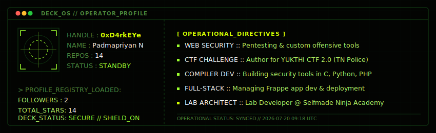
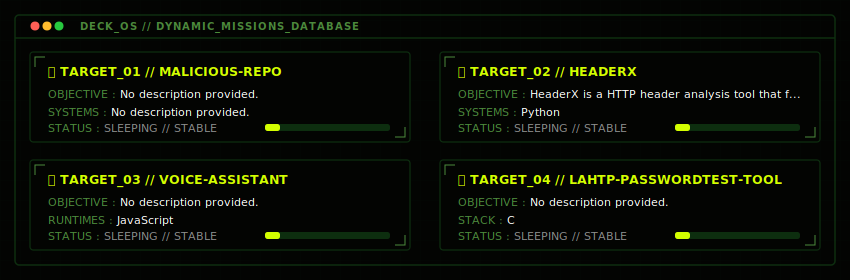

<!-- 0xD4rkEYe · Cyber-Deck terminal console · Red Team & Security Research Profile -->

<!-- ══════════════════════════ HUD HEADER ══════════════════════════ -->

 

<!-- Animated Cyber-Deck Banner -->

 

<!-- Typing Terminal Sub-header -->

 

<!-- Core Telemetry Status Badges -->

&nbsp;

&nbsp;

&nbsp;

  

<!-- Navigation Links / Matrix Directories -->

&nbsp;

&nbsp;

  

---

<!-- ══════════════════════════ SYSTEM CONSOLE (ABOUT) ══════════════════════════ -->

<h3><code>[SYS_STATUS // OPERATOR_PROFILE_&amp;_DIRECTIVES]</code></h3>

 

<!-- ══════════════════════════ SYSTEM ARSENAL (SKILLS) ══════════════════════════ -->

  <h3><code>[SYS_ARSENAL // SECURITY_TOOLKIT_LOADOUT]</code></h3>

<table align="center" width="98%">
<tr>
<td style="border: 1px solid #0d2e0f; padding: 15px; background-color: #030402;">

<b>▶ [DECK_MODULE_01] OFFENSIVE RESEARCH &amp; ANALYSIS</b>

 

  
    
  
  &nbsp;
  
  &nbsp;
  
  &nbsp;
  

 

<b>▶ [DECK_MODULE_02] COMPILER SYSTEMS &amp; RUNTIMES</b>

 

  

 

<b>▶ [DECK_MODULE_03] ORCHESTRATION &amp; INFRASTRUCTURE</b>

 

  

 

</td>
</tr>
</table>

 

<!-- ══════════════════════════ PROJECTS (MISSIONS) ══════════════════════════ -->

<h3><code>[SYS_MISSIONS // ACTIVE_OBJECTIVES_DATABASE]</code></h3>

 

<!-- ══════════════════════════ TELEMETRY (ANALYTICS) ══════════════════════════ -->

  <h3><code>[SYS_TELEMETRY // COMPUTATIONAL_METRICS_DASHBOARD]</code></h3>

<table align="center" width="98%">
<tr>
<td style="border: 1px solid #0d2e0f; padding: 15px; background-color: #030402;">

<!-- ROW 1: Stats Card + Streak -->

 

<!-- ROW 2: Top Languages + Productive Time -->

 

<!-- ROW 3: Stock Market Ticker Header -->

&nbsp;

&nbsp;

&nbsp;

  

<!-- ROW 4: Contribution Activity Graph (Stock Chart Style) -->

 

<!-- ROW 5: Market Indicators (Repos + Commits by Language) -->

&nbsp;

 

<!-- ROW 6: Commit Timeline (Profile Details) -->

 

<!-- ROW 7: Stats Ticker Tape -->

&nbsp;

 

</td>
</tr>
</table>

  

<!-- EOF -->
